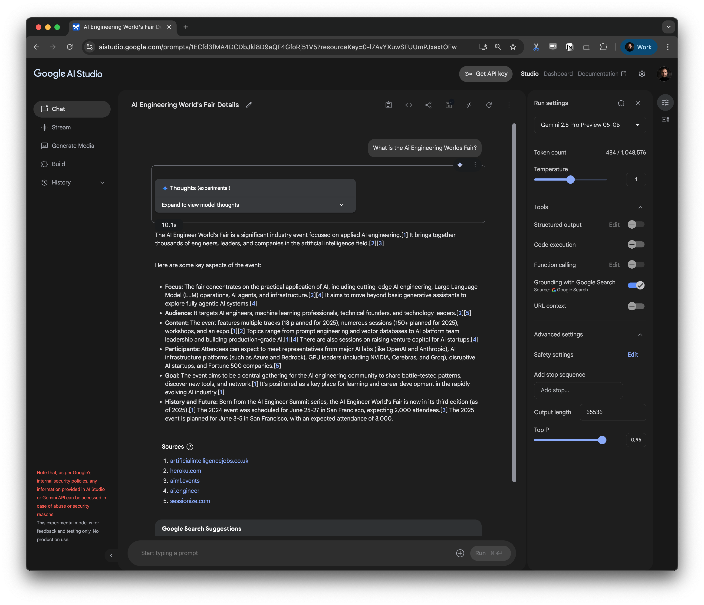
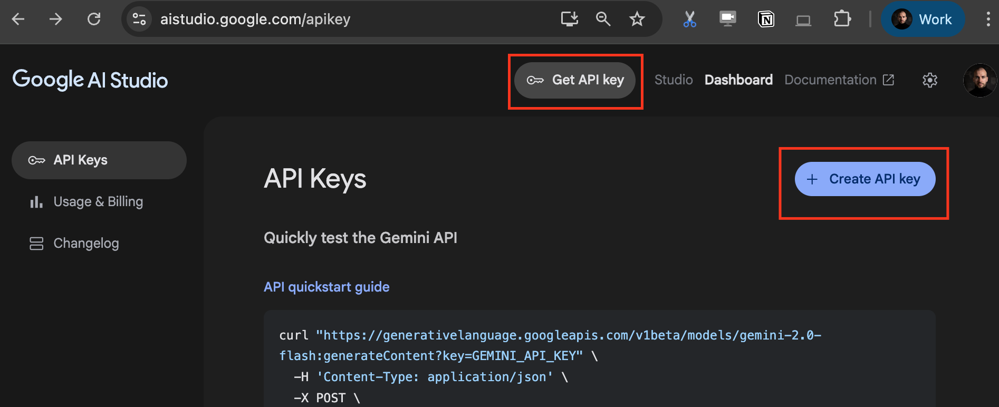
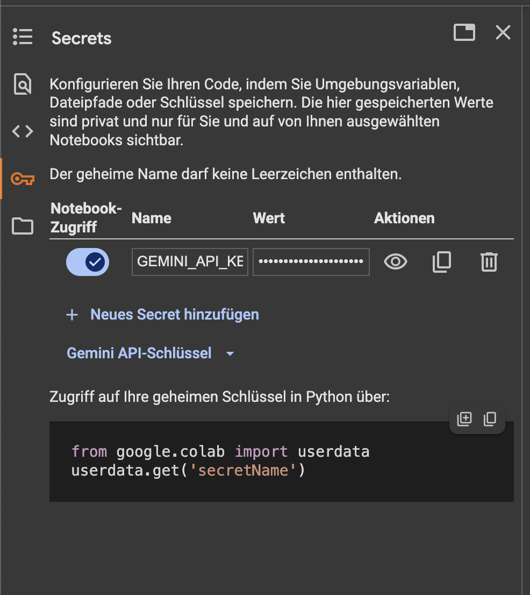

# Part 1: Setup and Authentication

## 0. Use the Google AI Studio as playground

[Google AI Studio](https://aistudio.google.com/) is a developer platform that allows you to quickly experiment with Google's Gemini models. It provides a user-friendly interface for crafting and testing prompts, adjusting model parameters, and then easily exporting the code to integrate into your applications. It's a great way to prototype and explore the capabilities of Google's AI models before diving into coding with the SDK. You'll use it in this workshop to get your API Key.



## 1. Get your API Key

To use the Gemini API, you'll need an API key.

1. Go to [Google AI Studio](https://aistudio.google.com/apikey) to create and retrieve your API key.

2. Copy the API key and store it as an environment variable `GOOGLE_API_KEY` or if you are using Colab, set it as secret in the notebook. 


**Important:** Keep your API key confidential.

## 2. Install the Python SDK

Open your terminal, command prompt or notebook and run the following command:

```bash
pip install -U -q "google-genai"
```

## 3. Configure the Client and Test Generation

```python
from google import genai
import sys
IN_COLAB = 'google.colab' in sys.modules

if IN_COLAB:
    from google.colab import userdata
    GOOGLE_API_KEY = userdata.get('GOOGLE_API_KEY')
else:
    GOOGLE_API_KEY = os.environ.get('GOOGLE_API_KEY',None)

# Create client with api key
client = genai.Client(api_key=GOOGLE_API_KEY)

# Test generation
response = client.models.generate_content(
    model="gemini-2.0-flash",
    contents="Hello, world!"
)
print(response.text)
```

## 4. Available Models

The Gemini API provides a range of powerful models to suit different needs. When you make an API call, you'll specify which model you want to use by its unique ID. You can always find the most up-to-date information on available models and their capabilities in the [official Google AI documentation](https://ai.google.dev/gemini-api/docs/models).


| Model Name                     | Model ID (Example)             | Free Tier Available | Notes (from pricing page)                                  |
| ------------------------------ | ------------------------------ | ------------------- | ---------------------------------------------------------- |
| Gemini 2.0 Flash               | `gemini-2.0-flash`             | Yes                 | Input and output are free of charge.                       |
| Gemini 2.5 Flash Preview       | `gemini-2.5-flash-preview-05-20`     | Yes                 | Input and output are free of charge.                       |
| Gemini 2.5 Pro Preview         | `gemini-2.5-pro-preview-05-06`       | No                  | Paid tier only.                                            |

**Note:** "Preview" models may change before becoming stable and might have more restrictive rate limits. Always check the official documentation for the latest details.

## Recap & Next Steps

**What You've Learned:**
- Setting up Google AI Studio as your development playground
- Obtaining and securing your Gemini API key
- Installing and configuring the `google-genai` Python SDK
- Making your first API call to test the connection
- Understanding available Gemini models and their capabilities

**Key Takeaways:**
- Always keep your API key secure and use environment variables
- Test your setup early to catch configuration issues
- Familiarize yourself with available models and their use cases
- Use Google AI Studio for quick prototyping and testing

**Next Steps:** Continue with [Part 1: Text Generation and Chat](https://github.com/philschmid/gemini-2.5-ai-engineering-workshop/blob/main/solutions/01_text_generation_and_chat.ipynb) [](https://colab.research.google.com/github/philschmid/gemini-2.5-ai-engineering-workshop/blob/main/solutions/01_text_generation_and_chat.ipynb)

**More Resources:**
- [Gemini API Documentation Quickstart](https://ai.google.dev/gemini-api/docs/quickstart?lang=python)
- [Available Models Overview](https://ai.google.dev/gemini-api/docs/models)
- [Google AI Studio](https://aistudio.google.com/) 